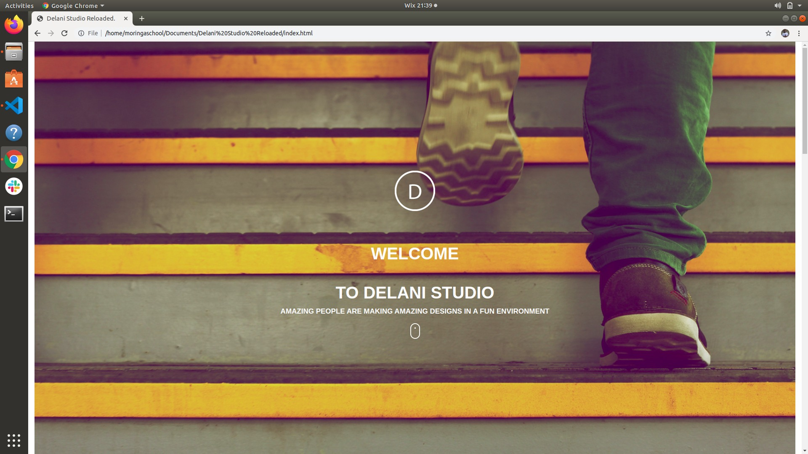

# Project Name.
**Delani Studio Reloaded**

# Author's Details.
Name: *Anthony Muli.*

Email: mulianthony561@gmail.com

FB: Anto De Sparta Neyo.

Tel:*+254796577998.*

## Project Description.
A ***web application** that illustrates what projects we do as a design studio.Come round and discover your talent and do what you heart.

## Project-Setup Instructions.
1.Open your github account.

2.Search for the github username:antomuli.

3.In antomuli's repositories,git clone the Delani Studio Reloaded repository into your you -local repository- which is your machine(computer) /git clone the following link: https://github.com/antomuli/Delani-Studio-Reloaded..git

## BDD 

Behavior  Driven  Development

|  Behaviour | Input  |  Output | 

|---------------------|--------------|---------------------------------------|

|  Enter your name |   ['Anthony']  | name ='Anthony   | 

|   Enter Email && Message |  ['Email','Message']  |  	Email && Message |  

|  Submit	Email && Message  |  Thank you Anthony, details received |  

## project screenshot
Delani-studio is a web application that illustrates what projects we do as a design studio. It includes a portfolio of some of our projects, and a detailed description of what we do from inception to completion of the project. ... The application also includes a form that allows users to enter their names and emails.Below is the blueprint of the website:

***EVERY GREAT DESIGN BEGINS WITH AN EVEN BETTER STORY.***

***DESIGN IS INTELLIGENCE MADE VISIBLE!***.

***YOU CAN'T USE UP CREATIVITY. THE MORE YOU USE THE MORE YOU HAVE.***

***BECAUSE YOUR EYES SAID YOU WERE FEELING IT TOO!***

### Live Link to Delani Studio Reloaded
The following is the live link to the project "Delani Studio Reloaded": This site was built using github pages: 

**The following include the list of technologies used: 

1.**html.5**

2.**CSS.**

3.**Bootsrap Version 4.3.1**

4.**Javascript.**

5.**JQuery.**

### Known Bugs

1.The *hover effect* may not be visible on some screen media unless clicked upon.

2.The *API* to the mailchimp is undefined.This means that I may be unable to receive your feedback via the contact session unless contacted through my personal details as mentioned above.

### LICENSE AND COPY RIGHT INFO.
MIT License
 Copyright (c) 2019 Moringa School-Anto

Permission is hereby granted, free of charge, to any person obtaining a copy of this software and associated documentation files (the "Software"), to deal in the Software without restriction, including without limitation the rights to use, copy, modify, merge, publish, distribute, sublicense, and/or sell copies of the Software, and to permit persons to whom the Software is furnished to do so, subject to the following conditions:

The above copyright notice and this permission notice shall be included in all copies or substantial portions of the Software.

THE SOFTWARE IS PROVIDED "AS IS", WITHOUT WARRANTY OF ANY KIND, EXPRESS OR IMPLIED, INCLUDING BUT NOT LIMITED TO THE WARRANTIES OF MERCHANTABILITY, FITNESS FOR A PARTICULAR PURPOSE AND NONINFRINGEMENT. IN NO EVENT SHALL THE AUTHORS OR COPYRIGHT HOLDERS BE LIABLE FOR ANY CLAIM, DAMAGES OR OTHER LIABILITY, WHETHER IN AN ACTION OF CONTRACT, TORT OR OTHERWISE, ARISING FROM, OUT OF OR IN CONNECTION WITH THE SOFTWARE OR THE USE OR OTHER DEALINGS IN THE SOFTWARE.